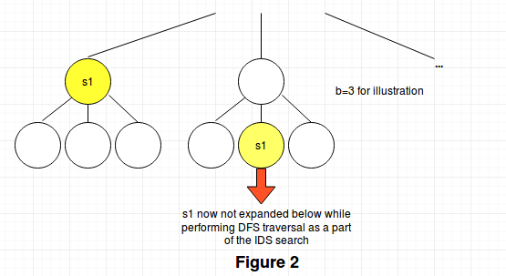

# AI_Assignment_1

This folder contains my solution for assignment 1 of on-campus Artificial Intelligence (BITS F444) course. The file description is as follows:

1. `Programming Assignment 1.pdf`: It contains the problem statement, and functionalities to be included in the solution. It also specifies the design of the GUI interface.
2. `main.py`: It contains the code implementing the solution.
3. `coding details (PA1).docx`: It describes the main aspects of implementation of the solution.

## Steps To Run The Code:
This code requires Python3.7 and PyQt5. To run it, use the command:
```sh
python main.py
``` 

## Introduction/Problem Statement:

The given problem asks to find the optimal path that should be followed by a vacuum cleaner (starting from a given random position) in a `N*N (N=10)` room to clean all the dirty tiles and rest at any one corner of the room. The cost of moving `1` step (`MR,ML,MU,MD`) is `2` units, and cost to clean a tile is `1` unit. We have to use uninformed search techniques like BFS and IDS to solve the problem.

## State Representation:

The state representation consists of following attributes:
1. Two integers x and y representing the current position of the vacuum cleaner
2. A bytearray of size `N*N (=100)`, where each byte is `0` (corresponding tile is clean) or `1` (corresponding tile is dirty)
3. An integer denoting the number of tiles currently dirty in the room (This helps to quickly check for goal test instead of we having to iterate `100` elements of bytearray each time to check for goal test).

Note that this will be one of the most space-efficient representations in Python.

An alternate representation that was thought of by me without using any 3rd party modules was to represent state of each tile as a bit of an integer. A `32-bit` integer occupies `28` bytes in Python (because ints are classes in Python), and hence `100` tiles would have needed `28*4=112` bytes, which doesn’t really help save memory compared to the bytearray implementation.

## Node Representation:

A node consists of the following attributes:
1. State (described above)
2. Cost to reach this state from initial state - Integer
3. Order of actions taken to reach this state from initial state - For space efficiency, a bytearray was chosen over a standard Python list, where each byte represents one of the five actions (`01-MR, 02-ML, 03-MU, 04-MD, 05-Suck Dirt`).

Note that this representation will also be very space-efficient as its uses the above mentioned state representation and also uses a bytearray to represent the list of actions taken.

## BFS Implementation:

* Python deque from collections module is used to serve the purpose of a queue. We can push elements by appending to the deque and pop elements by popping from left side of the deque. The deque will be much faster as a queue than a standard Python list as its implemented internally as a doubly linked list. As a result, deques have `O(1)` speed for pushing and pop elements at the ends, while lists have `O(n)` performance for the same.
* A Python set is used to keep track of already processed states so that we do not process them on encountering them again at a larger depth in the tree. This will decrease the time taken by BFS.
* Also, the implementation of BFS is kept such that we check for a node if it represents the goal state or not before pushing it in the queue. This means that we are able to reach the goal state by processing only elements of depth lower than the goal state, thus decreasing the time taken by avoiding processing elements at the same depth as the goal state. See `Figure 1` below.


## IDS Implementation:

* I implemented both the recursive version and the iterative version (using explicit stack) of IDS and found that the iterative version performs better than the recursive version w.r.t. time taken.
* A Python deque was used as a stack rather than the standard Python list as pushing and popping elements is `O(1)` time for deque and `O(n)` time for list.
* A Python dictionary was also used to keep track of the minimum depth at which a state is found in the tree, so that we don’t expand the state downwards while performing DFS traversal if the state occurs again in the tree at more depth. Due to the nature of this problem, this optimization considerably reduces the time taken by IDS by avoiding processing redundant nodes. See `Figure 2` below.



**Note**: For both BFS and IDS, `collect()` method of Python’s `gc` module was invoked at regular intervals while performing BFS or IDS search to force the Garbage Collector to release unreferenced memory.

## GUI Details:

I have stored the path obtained, path cost, time taken by BFS and IDS, and all other required statistics for 10 randomly generated initial states for a `10x10` room that you can visualise using the below specified buttons:

* `Option1` - Selects one of the `10` initial states randomly and displays the room environment graphically.
* `Option2` - Display action sequence and path cost outputted by BFS (for the initial state chosen by `Option1`) on the console.
* `Option3` - Display action sequence and path cost outputted by IDS (for the initial state chosen by `Option1`) on the console.
* `Option4` - Displays all the results (`R1` to `R12`, and `G1` to `G4`) for both BFS and IDS (for the initial state chosen by `Option1`).


**Note**: I have also provided the functionality to check/run my BFS and IDS code through the GUI - You can choose the size of room and percent of dirt, and can see all the results returned by BFS and IDS printed on the console.

