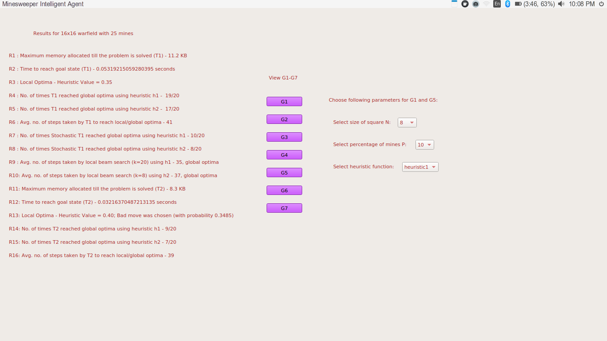
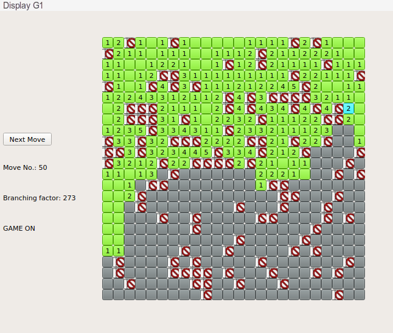
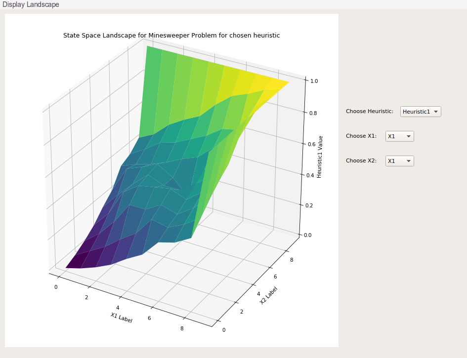
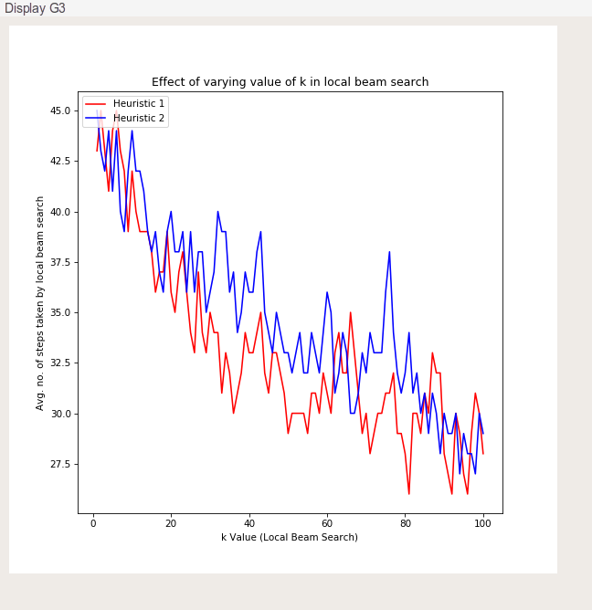
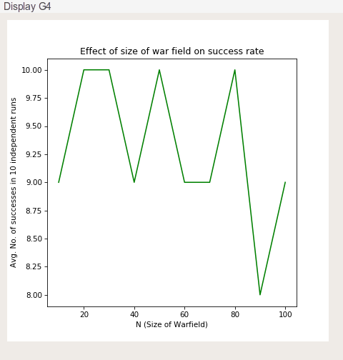
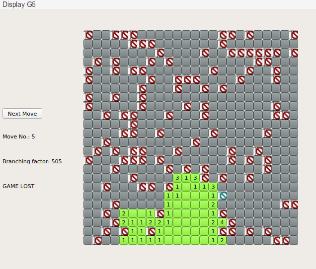
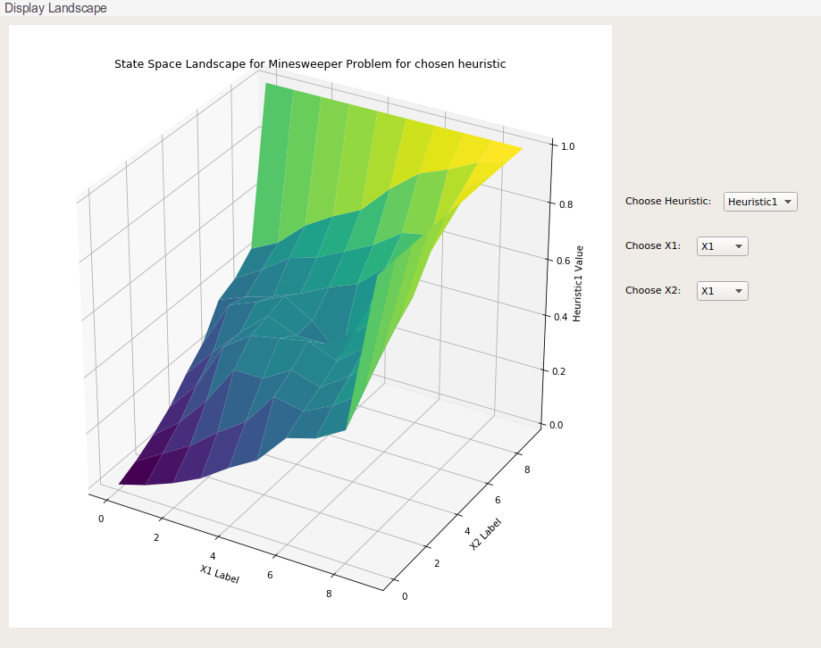
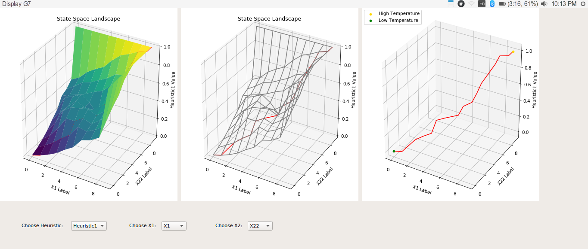

# AI_Assignment_2

This folder contains my solution for assignment 2 of on-campus Artificial Intelligence (BITS F444) course. The file description is as follows:

1. `Programming assignment 2.pdf`: It contains the problem statement, and functionalities to be included in the solution. It also specifies the design of the GUI interface.
2. `utils.py`: It contains code for state representation for informed (heuristic) search algorithms (like hill climbing and simulated annealing).
3. `heuristics.py`: It contains implementation of two different heuristic functions.
4. `algorithms.py`: It contains implementation of hill climbing, stochastic hill climbing, local beam search, and simulated annealing algorithms.
5. `GUI.py`: It contains GUI implementation.
6. `coding details.docx`: It describes the main aspects of implementation of the solution.

## Steps To Run The Code:
This code requires Python3.7 and PyQt5. To run it, use the command:
```sh
python GUI.py
``` 
## Introduction/Problem Statement:

The given problem asks to use **heuristic search algorithms (like hill climbing and simulated annealing)** to play minesweeper game. More details can be found in `Programming assignment 2.pdf`.

## GUI Details:
The overall GUI layout is as shown below.



As asked in `Programming assignment 2.pdf`, the GUI consists of the following buttons:

1. G1: Display how agent progresses in playing minesweeper using hill climbing algorithm.


2. G2: Display the landscape of the heuristic function w.r.t. any two state dimensions.


3. G3: Display the plot of number of steps taken by local beam search to fully play the game vs. the value of `k` for local beam search.


4. G4: Display the plot of success rate of hill climbing in 10 independent runs vs minesweeper board size.


5. G5: Display how agent progresses in playing minesweeper using simulated annealing algorithm.


6. G6: Display the landscape of the heuristic function w.r.t. any two state dimensions.


7. G7: Display how agent progresses along the heuristic function landscape with decreasing temperature for simulated annealing algorithm.


