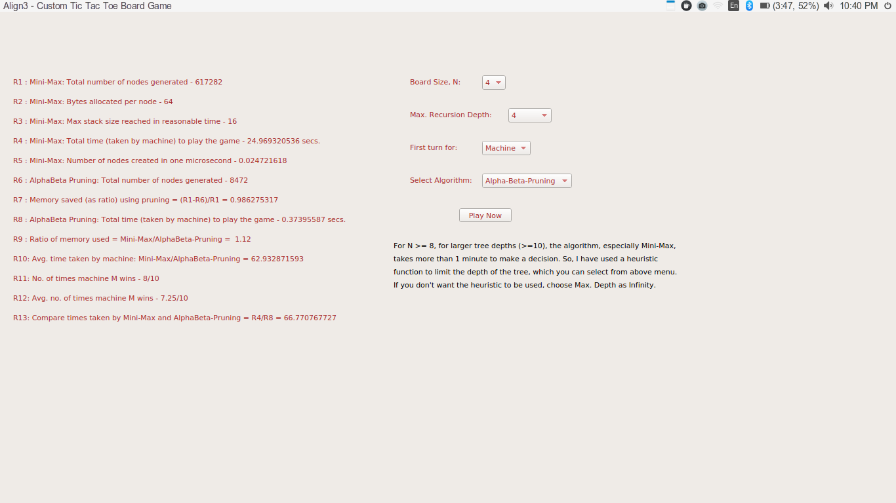
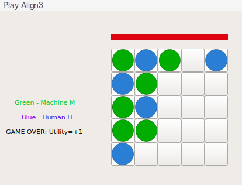

# AI_Assignment_3

This folder contains my solution for assignment 3 of on-campus Artificial Intelligence (BITS F444) course. The file description is as follows:

1. `Programming Assignment 3.pdf`: It contains the problem statement, and functionalities to be included in the solution. It also specifies the design of the GUI interface.
2. `utils.py`: It contains code for state representation for min-max and alpha-beta pruning algorithms.
3. `algo.py`: It contains implementation of heuristic function (to limit depth of search tree), min-max algorithm and alpha-beta pruning algorithm.
4. `GUI.py`: It contains GUI implementation.
5. `coding details PA3.docx`: It describes the main aspects of implementation of the solution.

## Steps To Run The Code:
This code requires Python3.7 and PyQt5. To run it, use the command:
```sh
python GUI.py
``` 
## Introduction/Problem Statement:

`Programming assignment 3.pdf` describes Align3, a custom tic-tac-toe board game. The problem task is to use **Min-Max algorithm** and **Alpha-Beta Pruning algorithm** to make an intelligent agent to play Align3 against a human player. **Space and time complexity comparison between Min-Max algorithm and Alpha-Beta Pruning algorithm is also performed**.

## GUI Details:
The overall GUI layout is as shown below.



To play the game, press the `Play Now' button.



