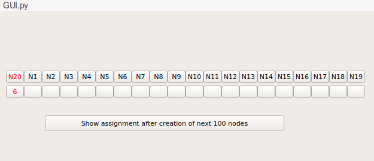

# AI_Assignment_4

## Introduction/Problem Statement:

`Programming assignment 4.pdf` describes a **constraint satisfaction problem (CSP)**. The problem task is to use **DFS-backtracking** and **DFS-backtracking with AC3 algorithms** to solve the CSP or report that the CSP has no solution. **Space and time complexity comparison between DFS-backtracking and DFS-backtracking with AC3 algorithms is also performed.**

## File Description:

This folder contains my solution for assignment 4 of on-campus Artificial Intelligence (BITS F444) course. The file description is as follows:

1. `Programming Assignment 4.pdf`: It contains the problem statement, and functionalities to be included in the solution. It also specifies the design of the GUI interface.
2. `utils.py`: It contains code for state representation and constraint satisfaction problem representation.
3. `algo.py`: It contains implementation of DFS-backtracking and DFS-backtracking with AC3 algorithms.
4. `GUI.py`: It contains GUI implementation.
5. `testcases.txt`: It contains some sample testcases tried out by me.
6. `coding details PA4.docx`: It describes the main aspects of implementation of the solution.

## Steps To Run The Code:
This code requires Python3.7 and PyQt5. To run it, use the command:
```sh
python GUI.py
``` 

## GUI Details:
The overall GUI layout is as shown below.


To see the how each of DFS\_BT and DFS\_BT\_AC3 progress to solve the CSP, press the `Run DFS_BT` and `Run DFS_BT_AC3` buttons respectively.




