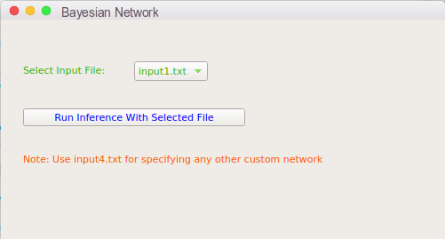
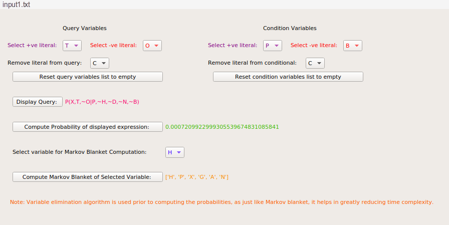
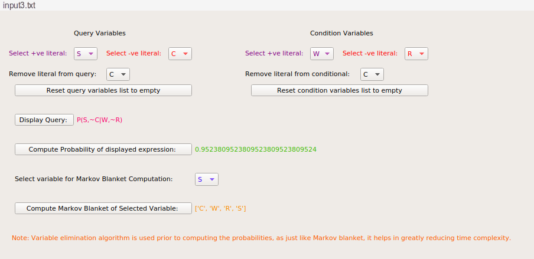

# AI_Assignment_6

This folder contains my solution for assignment 6 of on-campus Artificial Intelligence (BITS F444) course. The file description is as follows:

1. `Programming Assignment 6.pdf`: It contains the problem statement, and functionalities to be included in the solution. It also specifies the design of the GUI interface.
2. `utils.py`: It contains code for Bayesian Network representation, reading input from file and topological ordering.
3. `algo.py`: It contains code to compute required conditional probability and markov blanket of any node.
4. `gui.py`: It contains GUI implementation.
5. `coding details PA6.pdf`: It describes the main aspects of implementation of the solution.

## Steps To Run The Code:
This code requires Python3.7 and PyQt5. To run it, use the command:
```sh
python gui.py
``` 
## Introduction/Problem Statement:

`Programming assignment 6.pdf` describes a Bayesian Network modelling uncertainities of the environment. The problem task is to compute markov blanket of any node in the Bayesian Network and also compute the required conditional probabilities of some variables given some other variables.

## GUI Details:
The overall GUI layout is as shown below.



Select appropriate input file and click on `Run Inference With Selected File` button to compute both markov blankets and conditional probabilities.





